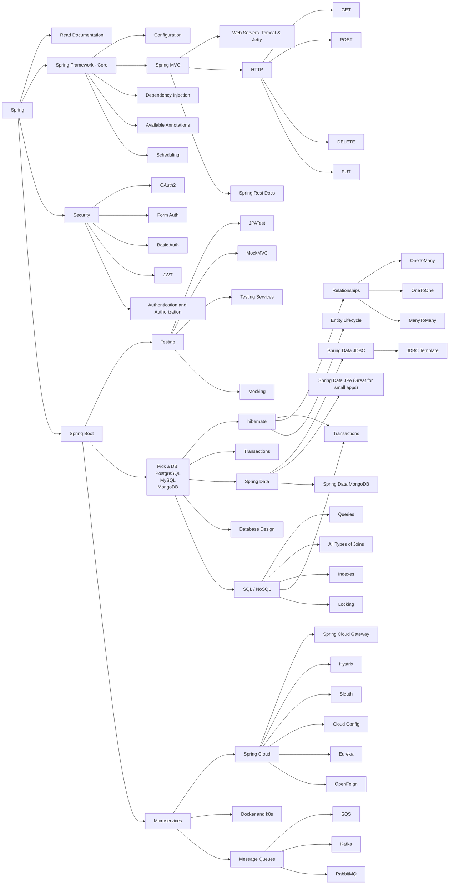

# Spring-Boot-Notes

## Roadmap:

```mermaid
flowchart LR
    A["Spring"]
    B["Read Documentation"]
    C["Spring Framework - Core"]
    D["Security"]
    E["Spring Boot"]
    A --> B & C & D & E

    F["Configuration"]
    G["Spring MVC"]
    H["Dependency Injection"]
    I["Available Annotations"]
    J["Scheduling"]
    C --> F & G & H & I & J

    K["OAuth2"]
    L["Form Auth"]
    M["Basic Auth"]
    N["JWT"]
    O["Authentication and Authorization"]
    D --> K & L & M & N & O

    P["Testing"]
    Q["JPATest"]
    R["MockMVC"]
    S["Testing Services"]
    T["Mocking"]
    E --> P
    P --> Q & R & S & T

    Tom["Web Servers. Tomcat & Jetty"]
    http["HTTP"]
    get["GET"]
    post["POST"]
    del["DELETE"]
    put["PUT"]
    docs["Spring Rest Docs"]
    G --> Tom & http & docs
    http --> get & post & del & put

    db["`Pick a DB:
         PostgreSQL
         MySQL
         MongoDB`"]
    micro["Microservices"]
    E --> db & micro

    hb["hibernate"]
    trans["Transactions"]
    sd["Spring Data"]
    dbDes["Database Design"]
    sql["SQL / NoSQL"]
    db --> hb & trans & sd & dbDes & sql

    tr["Transactions"]
    rs["Relationships"]
    life["Entity Lifecycle"]
    hb --> tr & rs & life

    rs1["OneToMany"]
    rs2["OneToOne"]
    rs3["ManyToMany"]
    rs --> rs1 & rs2 & rs3

    jdbc["Spring Data JDBC"]
    temp["JDBC Template"]
    jpa["Spring Data JPA (Great for small apps)"]
    mongo["Spring Data MongoDB"]
    sd --> jdbc --> temp
    sd --> jpa & mongo

    query["Queries"]
    joins["All Types of Joins"]
    ind["Indexes"]
    tr["Transactions"]
    lock["Locking"]
    sql --> query & joins & ind & tr & lock

    sp["Spring Cloud"]
    sp1["Spring Cloud Gateway"]
    sp2["Hystrix"]
    sp3["Sleuth"]
    sp4["Cloud Config"]
    sp5["Eureka"]
    sp6["OpenFeign"]
    micro --> sp --> sp1 & sp2 & sp3 & sp4 & sp5 & sp6

    dock["Docker and k8s"]
    msg["Message Queues"]
    msg1["SQS"]
    msg2["Kafka"]
    msg3["RabbitMQ"]
    micro --> dock & msg
    msg --> msg1 & msg2 & msg3
```
----
1. INTRODUCTION
   - [Spring Boot Overview](./Introduction/intro.md)
2. [Spring Boot - REST API](./api.md)
   
