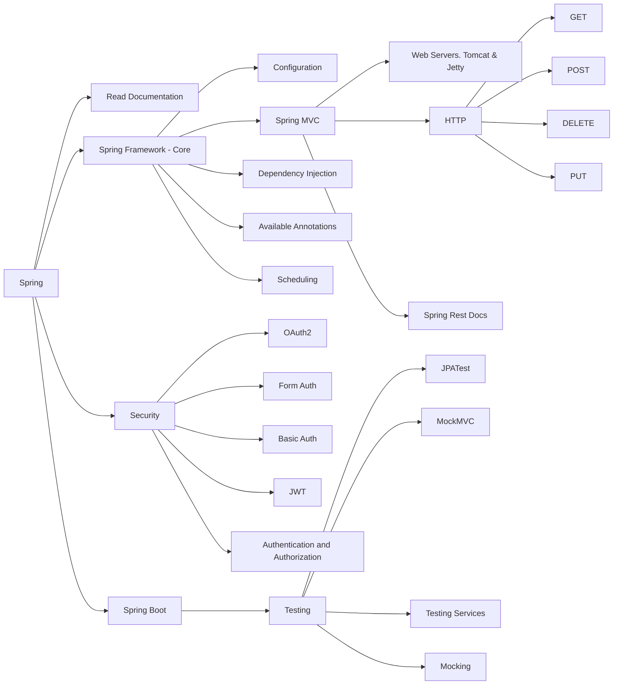

# Spring-Boot-Notes

## Roadmap:

```mermaid
flowchart LR
    A["Spring"]
    B["Read Documentation"]
    C["Spring Framework - Core"]
    D["Security"]
    E["Spring Boot"]
    A --> B & C & D & E

    F["Configuration"]
    G["Spring MVC"]
    H["Dependency Injection"]
    I["Available Annotations"]
    J["Scheduling"]
    C --> F & G & H & I & J

    K["OAuth2"]
    L["Form Auth"]
    M["Basic Auth"]
    N["JWT"]
    O["Authentication and Authorization"]
    D --> K & L & M & N & O

    P["Testing"]
    Q["JPATest"]
    R["MockMVC"]
    S["Testing Services"]
    T["Mocking"]
    E --> P
    P --> Q & R & S & T

    Tom["Web Servers. Tomcat & Jetty"]
    http["HTTP"]
    get["GET"]
    post["POST"]
    del["DELETE"]
    put["PUT"]
    docs["Spring Rest Docs"]
    G --> Tom & http & docs
    http --> get & post & del & put
```
