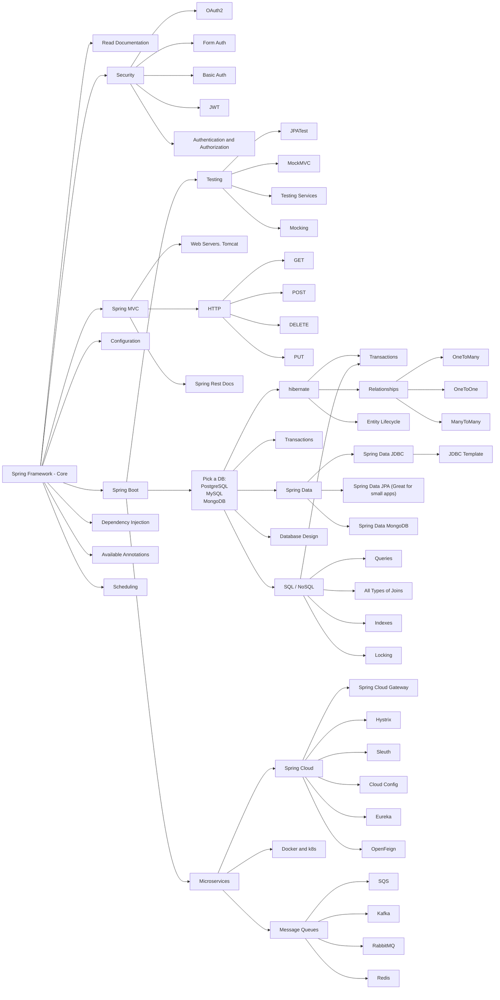

# Spring-Boot-Notes

## Roadmap:

----
1. INTRODUCTION
   - [Spring Boot Overview](./Introduction/intro.md)
   - [Developing First Spring Boot Application](./Introduction/first.md)
2. DEVELOPING WITH SPRING BOOT
   - [Build Systems](./Developing/build.md)
   - [Configuration Class](./Developing/config.md)
   - [Auto-Configuration Class](./Developing/auto.md)
   - [Spring Beans and Dependency Injection](./Developing/injection.md)
   - [Running Your Application](./Developing/running.md)
4. [Spring Boot - REST API](./api.md)
5. PROPERTIES:
   - [Default Properties file](./Properties/default.md)
   - [Environment Specific properties file](./Properties/env.md)
   - [Using YAML instean of properties](./Properties/yaml.md)
